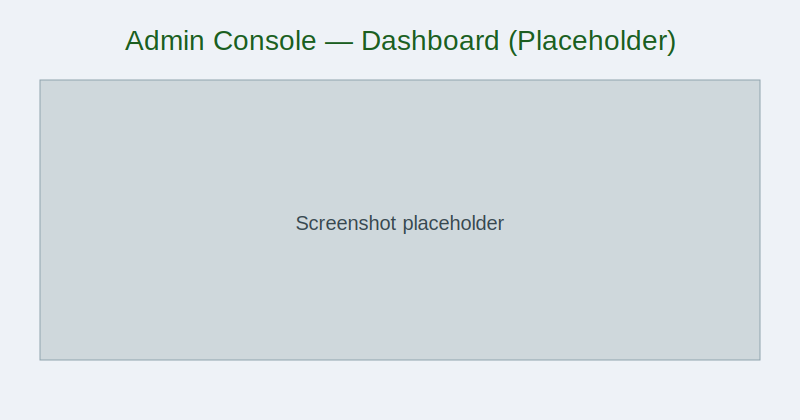
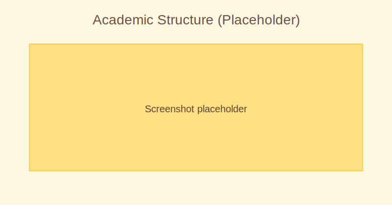
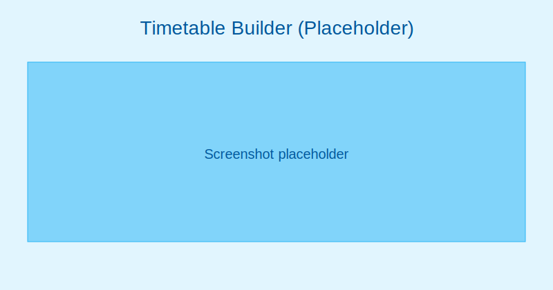
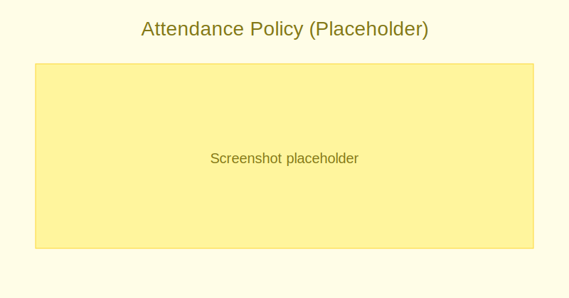
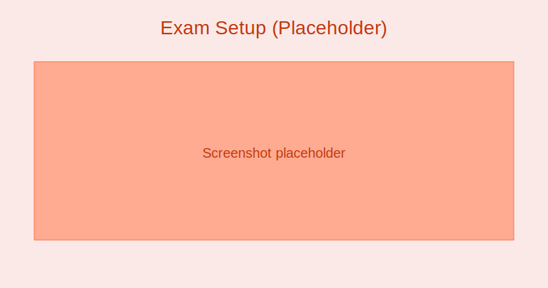
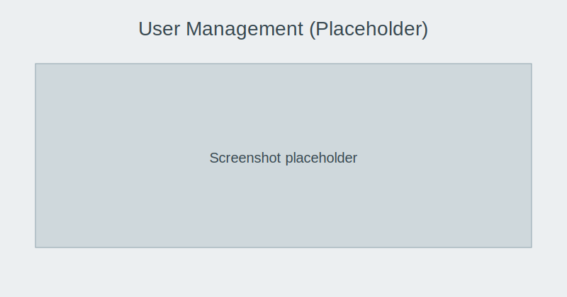
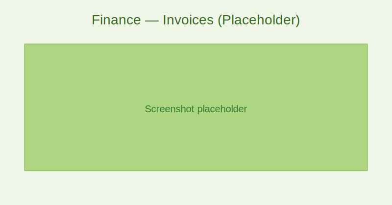
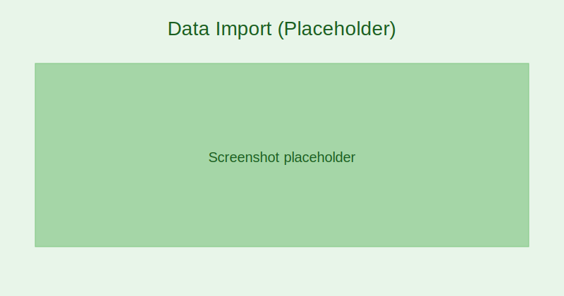
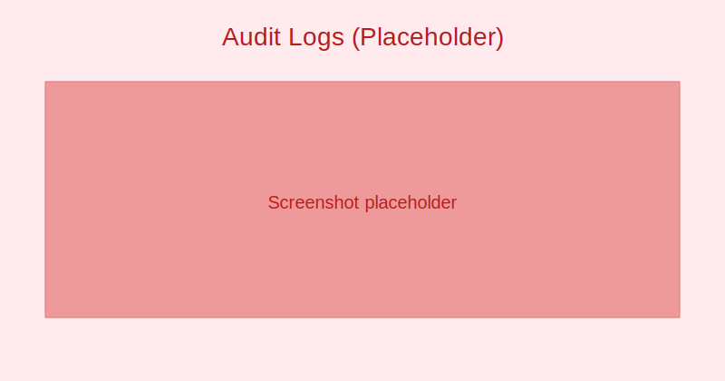

# School Admin Guide

Admin Console overview:
- Dashboard: High-level metrics (attendance, dues, messages)
- Quick actions: Add student, schedule exam, create invoice
- Navigation: Academic, Users, Finance, Messaging, Reports, Settings

:::tip Screenshot
Admin Console — Dashboard

_The Admin Console dashboard shows attendance rate, fee collection, and quick actions for common tasks._
:::

Academic setup:
- Sessions & Terms: Define academic calendar
- Classes & Sections: Structure by grade and cohorts
- Subjects: Create, categorize (core/elective), and assign to classes
- Timetable: Periods, rooms, teachers, substitutions

:::note Screenshot
Academic Structure configuration

_Configure sessions, classes, sections, and subjects before assigning teachers and students._
:::

:::tip Screenshot
Timetable builder

_Create and publish weekly schedules; manage rooms and teacher allocations._
:::

Attendance configuration:
- Mode: Daily (AM/PM) or Period-based per subject
- Policies: Late grace, absence reasons, approval workflow
- Parent notifications: Enable/disable instant alerts

:::note Screenshot
Attendance policy settings

_Define how and when attendance can be taken or corrected, and who approves changes._
:::

Grades & assessments:
- Exam types and weightages
- Rubrics and grading scales (numeric/letter)
- Gradebook templates and auto-calculation rules
- Transcript formats and approval

:::tip Screenshot
Exam types and setup

_Set exam types (Midterm, Final), weightages, and term mappings for transcripts._
:::

Student information:
- Create/Edit Student Profile
- Enrollment and promotions between sessions
- Documents: Upload and manage attachments
- Health and emergency contacts

Users & permissions:
- Roles: Admin, Teacher, Parent, Student, Finance, Registrar
- Custom roles for fine-grained access
- Bulk invite and deactivation
- MFA, password policy, and SSO

:::note Screenshot
User management — staff and invitations

_Invite staff, assign roles, and deactivate accounts when necessary._
:::

:::tip Screenshot
Permissions matrix

_Tailor access by module and action to enforce least-privilege._
:::

Finance:
- Fee heads and structures
- Scholarships, concessions, and transport fees
- Invoices, due dates, penalties
- Payment gateways and reconciliation

:::tip Screenshot
Finance — Invoices overview

_Monitor invoice statuses, send reminders, and record payments._
:::

:::note Screenshot
Payment gateway configuration

_Connect your payment provider and verify webhook callbacks for reconciliation._
:::

Data import/export:
- CSV templates and validation previews
- Partial pilots before full import

:::note Screenshot
Bulk data import

_Preview detected columns and errors before committing large imports._
:::

Security & compliance:
- Audit logs and incident response
- Data retention and export policies

:::tip Screenshot
Audit logs view

_Track configuration changes and access events for compliance._
:::

Messaging:
- Channels: In-app, email, push, SMS (if configured)
- Audiences: All users, specific roles, classes, or custom lists
- Templates and schedule
- Policy: Quiet hours and escalation rules

Reports & analytics:
- Operational reports: Attendance, fee collection, overdue
- Academic reports: Performance by class/subject
- Compliance reports: Audit, access logs, data exports
- Scheduled exports to SFTP or email
