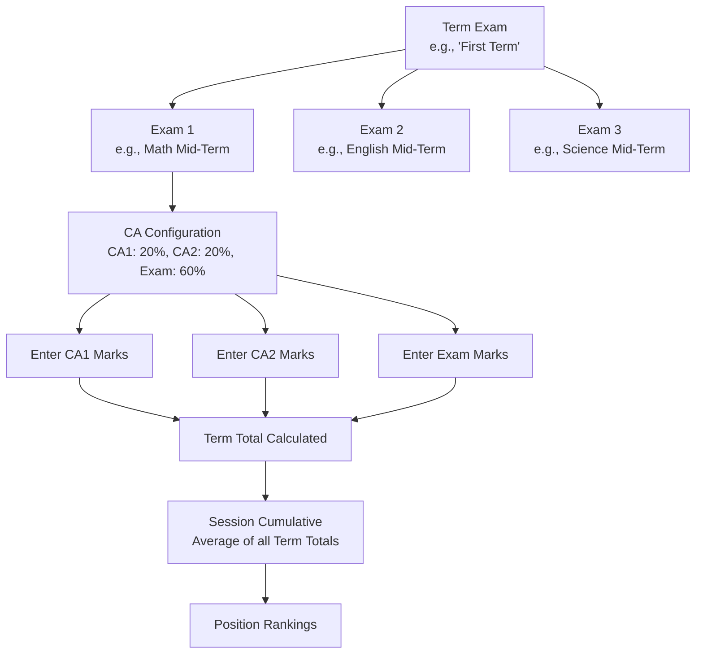

# Continuous Assessment (CA) System

import Link from '@docusaurus/Link';

:::tip New in v1.9.3
The Continuous Assessment system introduces progressive evaluation with weighted scoring. Configure CA1, CA2, and Exam components with custom weightages (e.g., CA1 20% + CA2 20% + Exam 60%), track term and session performance, and generate enhanced report cards with complete CA breakdown. Fully backward compatible with existing exams.
:::

The Continuous Assessment (CA) system in 4SCH enables schools to implement progressive evaluation with configurable weightages for different assessment components. Track student performance across CA1, CA2, and final exams with automated weighted calculations.

:::tip Quick Access
- 📊 **<Link to="/guides/offline-exams">Offline Exams Guide</Link>** - Traditional exam management
- 🎯 **[Quick Reference](#quick-reference)** - Fast lookup for common tasks
- 🚀 **[Getting Started](#getting-started)** - Set up your first CA configuration
:::

---

## Overview

:::info Understanding Academic Periods and Term Exams
4SCH uses two complementary concepts to organize your school year:

- **Academic Periods (Semesters)** - Used for organizing subjects, lessons, and timetables. Many schools rename "Semester" to "Term" when they have more than two academic periods (e.g., Term 1, Term 2, Term 3).

- **Term Exams (Exam Periods)** - Used for organizing exams and calculating Continuous Assessment (CA) results. Each Term Exam represents a major assessment period with its own CA configuration.

**For the CA system, you'll work with Term Exams.** Best practice: create a Term Exam for each Academic Period in your school year (e.g., if you have three academic periods, create three Term Exams with matching names).
:::

### What is Continuous Assessment?

Continuous Assessment (CA) is a progressive evaluation method that:

- **Distributes Assessment** - Breaks down evaluation into multiple components (CA1, CA2, Final Exam)
- **Weighted Scoring** - Each component contributes a percentage to the final grade
- **Term Totals** - Automatically calculates weighted totals for each term
- **Session Tracking** - Computes cumulative averages across all terms in a session
- **Position Ranking** - Ranks students based on session cumulative performance

### Key Features

- ✅ **Flexible Configuration** - Define custom CA types and weightages per exam
- ✅ **Automated Calculations** - System calculates weighted scores automatically
- ✅ **Validation** - Ensures weightages total exactly 100%
- ✅ **Term Management** - Organize exams into academic terms
- ✅ **Session Cumulative** - Track overall performance across terms
- ✅ **Dual Ranking** - Both term position and session position
- ✅ **Backward Compatible** - Works seamlessly with existing exams
- ✅ **Enhanced Reports** - PDF report cards show complete CA breakdown

### CA Components

A typical CA configuration includes:

| Component | Example Weightage | Purpose |
|-----------|-------------------|---------|
| **CA1** | 20% | First continuous assessment (tests, quizzes) |
| **CA2** | 20% | Second continuous assessment (assignments, projects) |
| **CA3** | 10% | Optional third assessment (practical work) |
| **Final Exam** | 60% | Main examination |
| **Total** | **100%** | Combined assessment |

### Example Calculation

**Student: John Doe | Subject: Mathematics**

```
CA1 (20%):    45/50 = 90% → 90 × 20% = 18 points
CA2 (20%):    40/50 = 80% → 80 × 20% = 16 points
Exam (60%):   85/100 = 85% → 85 × 60% = 51 points
────────────────────────────────────────────────
Term Total:   18 + 16 + 51 = 85%
```

If John has 3 terms with totals 85%, 78%, 88%:
- **Session Cumulative:** (85 + 78 + 88) / 3 = **83.67%**

---

## How CA Works: Complete Workflow

Understanding the full CA workflow helps you set up assessments correctly. Here's how everything connects from Term Exams down to individual CA scores.

### The CA Hierarchy

CAs (CA1, CA2, etc.) are **not created standalone**. They are part of a layered structure:



### Key Insight: The Layered Structure

Think of it like a folder system:

| Level | What It Is | Example |
|-------|-----------|---------|
| **1. Term Exam** | The assessment period (folder) | "First Term" |
| **2. Exam** | A specific subject's exam (file) | "Math Mid-Term" |
| **3. CA Configuration** | How marks are weighted (settings) | CA1 (20%) + CA2 (20%) + Exam (60%) |
| **4. CA Marks** | Actual scores entered | CA1: 18/20, CA2: 16/20, Exam: 51/60 |
| **5. Term Total** | Calculated weighted result | 85% |
| **6. Session Cumulative** | Average across all terms | 83.67% |

---

### 5-Step End-to-End Process

Here's the complete walkthrough from creating a Term Exam to viewing final results.

#### Step 1: Create a Term Exam

**Where:** Sidebar → **Exam & Performance → Offline Exam → Manage Term Exams**

**Why:** Term Exams group related exams into assessment periods (e.g., "First Term," "Mid-Year").

**Action:**
1. Click **"Create Term Exam"**
2. Fill in:
   - **Name**: "First Term" (match your Academic Period name)
   - **Session Year**: Current academic year
   - **Start Date**: When the term begins
   - **End Date**: When the term ends
3. Click **Submit**

✅ **Result:** Your Term Exam appears in the list, ready to hold individual exams.

#### Step 2: Create an Exam (linked to Term Exam)

**Where:** Sidebar → **Exam & Performance → Offline Exam → Manage Exam**

**Why:** Each subject needs its own exam linked to the Term Exam.

**Action:**
1. Click **"Create Exam"**
2. Fill in:
   - **Name**: "Mathematics Mid-Term"
   - **Term Exam**: Select your Term Exam (e.g., "First Term") from dropdown
   - **Class Section**: The class taking this exam
   - **Session Year**: Current session
   - **Exam Weightage**: Set the final exam's weight (e.g., **60%**)
3. Click **Submit**

✅ **Result:** Your exam is created and linked to the Term Exam. The exam weightage is the percentage the final exam contributes (the rest comes from CAs).

:::tip Exam Weightage Tip
If you want CA1 (20%) + CA2 (20%) + Exam (60%) = 100%, set exam weightage to **60**. The CA weightages will fill the remaining **40%**.
:::

#### Step 3: Configure CA Types for the Exam

**Where:** On the Exam list, find your exam and click **"Configure CAs"** button

**Why:** Define how the assessment is broken down (CA1, CA2, etc.) and their weightages.

**Action:**
1. Click **"Configure CAs"** next to your exam
2. The CA Configuration modal opens showing:
   - Final Exam Weightage (e.g., 60%)
   - CA Types section (initially empty)
3. Click **"Add CA Type"** for each CA:
   - **CA1**: Type "CA1", Weightage = 20
   - **CA2**: Type "CA2", Weightage = 20
   - *(Optional)* CA3, CA4, CA5 if needed
4. Watch the **Total Weightage** indicator:
   - 🟢 Green when total = 100%
   - 🔴 Red when total ≠ 100%
5. Click **"Save Configuration"** when total = 100%

✅ **Result:** Your exam now has a defined CA structure. Teachers can enter marks for each CA type separately.

:::caution Important
The system **prevents saving** if the total weightage doesn't equal exactly 100%. Adjust the values until you see the green indicator.
:::

#### Step 4: Enter Marks per CA Type

**Where:** Sidebar → **Exam & Performance → Offline Exam → Submit Marks**

**Who:** Subject teachers enter marks for their classes

**Action (repeat for each CA type):**

1. Select your **Exam** (e.g., "Mathematics Mid-Term")
2. Select the **Subject** (e.g., "Mathematics")
3. **Choose CA Type** from the dropdown:
   - First time: Select **CA1** → Enter CA1 marks for all students
   - Then: Select **CA2** → Enter CA2 marks for all students
   - Finally: Select **Exam** → Enter Final Exam marks
4. For each student, enter:
   - **Total Marks**: Maximum possible (e.g., 20 for CA1)
   - **Obtained Marks**: Student's actual score
5. Choose:
   - **Save as Draft** - Continue editing later (not visible to students)
   - **Publish** - Make marks visible to students immediately

✅ **Result:** Marks are recorded for each CA type independently.

:::tip Submit Marks in Stages
You don't need to submit all CA types at once. As assessments happen, submit them:
- After CA1 quiz: Submit CA1 marks
- After CA2 assignment: Submit CA2 marks  
- After Final Exam: Submit Exam marks
:::

#### Step 5: Publish Results

**Where:** Sidebar → **Exam & Performance → Offline Exam → Manage Exam**

**Action:**
1. Find your exam in the list
2. Click **"Publish Results"**
3. The system automatically calculates:
   - **Term Total** for each student (weighted CA + Exam)
   - **Session Cumulative Average** (across all terms)
   - **Session Position** (class ranking)

✅ **Result:** Students and parents can now view:
- Detailed CA breakdown on web portal
- Term totals and percentages
- Session cumulative average
- Position in class
- Downloadable PDF report cards

---

### Complete Worked Example

Let's trace one student's journey through the entire process.

**Setup:**
- **Term Exam**: "First Term" (Sept 1 - Dec 15)
- **Exam**: "Mathematics Mid-Term"
- **CA Configuration**: CA1 (20%) + CA2 (20%) + Exam (60%) = 100%

**Student: John Doe**

#### Mark Entry Phase

| Assessment | Total Marks | Obtained | Percentage | Weightage | Weighted Score |
|------------|-------------|----------|------------|-----------|----------------|
| **CA1** (Quiz) | 20 | 18 | 90% | 20% | **18.0** |
| **CA2** (Assignment) | 20 | 16 | 80% | 20% | **16.0** |
| **Exam** (Final) | 60 | 51 | 85% | 60% | **51.0** |

#### Calculation

```
Term Total = CA1 weighted + CA2 weighted + Exam weighted
           = 18.0 + 16.0 + 51.0
           = 85.0%
```

#### Session Cumulative (after 3 Term Exams)

If John scores in three terms:
- First Term: 85%
- Second Term: 78%
- Third Term: 88%

```
Session Cumulative = (85 + 78 + 88) / 3 = 83.67%
```

This is what appears on John's report card and determines his session position.

---

### Common Misconceptions

#### ❌ "I need to create CA1 from a separate menu"

**Reality:** CA1 (and other CAs) are configured **per Exam**, not standalone. Each exam has its own CA configuration.

#### ❌ "All exams share the same CA structure"

**Reality:** Each exam can have its own CA configuration. Math could be CA1 (20%) + CA2 (20%) + Exam (60%), while English could be CA1 (15%) + CA2 (25%) + Exam (60%).

#### ❌ "I configure CA at the Term Exam level"

**Reality:** Term Exam is just an organizing folder. CA configuration happens at the **individual Exam** level (Step 3).

#### ❌ "Once configured, I can't change the weightages"

**Reality:** You can edit CA configuration anytime by clicking "Configure CAs" again. Changes affect future calculations.

#### ❌ "All students need marks for all CAs at the same time"

**Reality:** Submit marks per CA type, per assessment date. CA1 marks today, CA2 marks next month—all stored independently.

---

### Quick Reference: Where to Do What

| To Do This... | Go Here | Required Permission |
|---------------|---------|---------------------|
| Create Term Exam | Manage Term Exams | School Admin |
| Create Exam | Manage Exam | School Admin |
| Configure CAs | Manage Exam → Configure CAs button | School Admin |
| Enter CA1/CA2/Exam Marks | Submit Marks | Teacher |
| Publish Results | Manage Exam → Publish | School Admin |
| View Term Total | Results page | All roles |
| View Session Cumulative | Results page | All roles |
| Download Report Card | Results page → PDF | Student/Parent |

---

### Workflow Summary

```
1. Term Exam created (organizes the period)
        ↓
2. Exam created (subject-specific assessment, linked to Term Exam)
        ↓
3. CA Configuration set (CA1, CA2, Exam weightages = 100%)
        ↓
4. Marks entered per CA type (CA1 → CA2 → Exam)
        ↓
5. Results published (system calculates everything)
        ↓
6. Students/Parents view: CA breakdown, Term Total, Session Cumulative
```

**Time investment:**
- Initial setup: ~15 minutes per exam
- Ongoing marks entry: ~5 minutes per CA per class

---

## Getting Started

### Prerequisites

Before setting up CA:

1. **Terms Created** - Academic terms defined for the session
2. **Exams Created** - Offline exams configured
3. **Classes Set Up** - Classes and sections properly configured
4. **Subjects Assigned** - Subjects linked to classes
5. **Students Enrolled** - Students assigned to classes

### Quick Setup (5 Minutes)

#### Step 1: Create Your First Term Exam

To get started, you'll need to create a Term Exam in your school's portal.

**Where to find it:** Look in the sidebar under **Exam & Performance → Offline Exam → Manage Term Exams**

:::info Finding the Menu
Open the sidebar menu and follow this path:

- **Exam & Performance**
  - **Offline Exam**
    - **Manage Exam** (existing)
    - **Manage Term Exams** ← New in v1.9.3
:::

**What you'll need to provide:**

- **Term Exam Name** - Give it a clear name like "Term 1 Exam" or "First Term Exam". For best results, use the same name as your matching Academic Period.
- **Session Year** - Select the current academic session.
- **Start Date** - When the assessment period begins.
- **End Date** - When the assessment period ends.

**Click Submit** to save your Term Exam.

:::tip Naming Best Practice
If your school uses "Term 1, Term 2, Term 3" for Academic Periods, name your Term Exams the same way. This makes it easier for teachers, students, and parents to understand which assessment relates to which teaching period.
:::

#### Step 2: Link Exam to Term

**Navigate:** Exams → Edit Exam

**Update:**
- **Select Term** - Choose the term created above
- **Exam Weightage** - Enter final exam percentage (e.g., 60%)

**Click Update** to save.

#### Step 3: Configure CA Types

**Navigate:** Exams → View Exams → Configure CAs (button)

**Add CA Types:**

1. Click **Add CA Type**
2. Select **CA Type** (CA1, CA2, CA3, etc.)
3. Enter **Weightage** (percentage)
4. Repeat for each CA

**Example Configuration:**
```
CA1: 20%
CA2: 20%
Exam Weightage: 60%
────────────
Total: 100% ✓
```

:::tip Real-Time Validation
The system validates as you type:
- ✅ Green indicator when total = 100%
- ❌ Red indicator when total ≠ 100%
- 📊 Progress bar shows current total
:::

**Click Save** to apply configuration.

---

## For School Administrators

### Managing Term Exams

:::tip New in v1.9.3
Term Exams organize your school's exams into logical assessment periods. Each Term Exam has its own CA configuration and contributes to the session cumulative average, helping you track student performance throughout the academic year.
:::

:::note Term Exams vs Academic Periods
You may have noticed two similar concepts in 4SCH. Here's how they work together:

- **Academic Periods (Semesters)** - These are your school's teaching periods. They organize subjects, lessons, and timetables. If your school uses "Term 1, Term 2, Term 3," you can rename Semesters to match.

- **Term Exams** - These are your assessment periods. Each Term Exam represents a major examination phase (with CA1, CA2, and Final Exam) that contributes to the academic period's overall result.

**How to use them together:**

1. Create your **Academic Periods** in Academic Settings (one per teaching period)
2. Create matching **Term Exams** in Exam Management (one per assessment period)
3. Use the same names for clarity (e.g., "Term 1" academic period → "Term 1" exam)

This separation gives you flexibility: you can have multiple Term Exams within a single Academic Period if needed, or align them one-to-one for traditional reporting.
:::

Term Exams organize your assessments throughout the academic year, enabling progressive evaluation through the CA system.

#### Creating Terms

**Navigate:** Terms → Create Term

**Best Practices:**
- Use consistent naming: "Term 1", "Term 2", "Term 3"
- Ensure dates don't overlap
- Link all exams in a term to the same term record
- Set realistic date ranges

#### Viewing Your Term Exams

**Where to find it:** Sidebar → **Exam & Performance → Offline Exam → Manage Term Exams**

**What you can do here:**

- See all your Term Exams in a searchable list
- Check how many exams are linked to each Term Exam
- Edit a Term Exam's details (name, dates)
- Delete Term Exams you no longer need
- Filter by session year to focus on the current academic year

:::warning Before Deleting a Term Exam
You cannot delete a Term Exam that has exams linked to it. To remove a Term Exam:

1. First, reassign or delete any exams linked to it
2. Then return to **Manage Term Exams** and delete the Term Exam

This protects your historical data and prevents accidental deletion.
:::

:::tip Keeping Things Aligned
Your Term Exams work best when they match your Academic Periods. Take a moment to compare your two lists:

- **Academic Periods**: Term 1, Term 2, Term 3
- **Term Exams**: Term 1 Exam, Term 2 Exam, Term 3 Exam

When the names align, teachers, students, and parents can easily understand how exams relate to teaching periods.

### Configuring CA for Exams

:::tip New in v1.9.3
Configure up to 5 CA types (CA1-CA5) with flexible weightages. The system validates in real-time, ensuring total weightage equals exactly 100%. Each exam can have its own CA configuration.
:::

#### Accessing CA Configuration

**Navigate:** Exams → View Exams → Configure CAs

Or when creating/editing an exam:
- Check the **Use Continuous Assessment** option
- The CA configuration modal will appear

#### Setting Up CA Weightages

**Steps:**

1. **Set Exam Weightage**
   - Enter the percentage for the final exam (e.g., 60%)
   - This represents the weight of the main examination

2. **Add CA Types**
   - Click **Add CA Type** button
   - Select CA type from dropdown (CA1, CA2, CA3, CA4, CA5)
   - Enter weightage percentage
   - Repeat for additional CAs

3. **Validate Total**
   - Ensure total = 100%
   - System shows real-time validation
   - Cannot save if total ≠ 100%

4. **Save Configuration**
   - Click **Save Configuration**
   - CA types are now active for this exam

**Example Configurations:**

**Standard Configuration:**
```
CA1: 20%
CA2: 20%
Exam: 60%
```

**Project-Based Configuration:**
```
CA1 (Quiz): 10%
CA2 (Assignment): 15%
CA3 (Project): 15%
Exam: 60%
```

**Practical-Heavy Configuration:**
```
CA1: 15%
CA2: 15%
CA3 (Practical): 20%
Exam: 50%
```

#### Editing CA Configuration

**Navigate:** Exams → View Exams → Configure CAs

**Steps:**
1. Modify weightages as needed
2. Ensure total remains 100%
3. Click Save

:::danger Impact on Existing Marks
Changing CA configuration after marks have been entered will recalculate all term totals. Ensure this is intentional before saving.
:::

### Publishing Results

#### How CA Affects Result Publishing

When you publish exam results:

1. **System Calculates:**
   - Weighted score for each CA component
   - Term total (sum of weighted scores)
   - Session cumulative average (across all terms)
   - Session position (ranking based on cumulative)

2. **Results Include:**
   - Individual CA scores with weightages
   - Term total percentage
   - Session cumulative (if multiple terms exist)
   - Both term position and session position

#### Publishing Process

**Navigate:** Exams → View Exams → Publish Results

**System Actions:**
1. Validates all students have marks for CA types
2. Calculates weighted totals
3. Computes session cumulative
4. Assigns session positions
5. Generates results

**Click Publish** to make results visible.

### Best Practices for Administrators

**Planning:**
- ✅ Define CA structure at beginning of session
- ✅ Keep weightages consistent across terms
- ✅ Communicate CA breakdown to teachers and parents
- ✅ Set clear deadlines for CA submissions

**Configuration:**
- ✅ Use meaningful CA names (align with school policy)
- ✅ Test with sample data before rolling out
- ✅ Document your CA policy for reference

**Monitoring:**
- ✅ Track CA submission progress
- ✅ Ensure all teachers submit all CA types
- ✅ Review calculated totals for accuracy
- ✅ Monitor session cumulative trends

---

## For Teachers

### Understanding CA Components

As a teacher, you'll enter marks for each CA component separately:

- **CA1** - First assessment (test, quiz, homework)
- **CA2** - Second assessment (assignment, project)
- **CA3+** - Additional assessments (if configured)
- **Exam** - Final examination

Each component has its own weightage contributing to the term total.

### Entering CA Marks

#### Accessing Marks Entry

**Navigate:** Exams → Submit Marks

**Select:**
1. **Exam** - Choose the exam
2. **Subject** - Your assigned subject
3. **CA Type** - Select which component (CA1, CA2, or Exam)

#### Step-by-Step: Entering CA Marks

**For Each CA Type:**

1. **Select CA Type**
   - Choose from dropdown: CA1, CA2, CA3, etc., or Exam
   - System loads student list for selected subject

2. **Enter Marks**
   - **Total Marks** - Maximum possible marks for this assessment
   - **Obtained Marks** - Student's actual score
   - Repeat for all students

3. **Save Options**
   - **Save as Draft** - Work in progress, not visible to students
   - **Publish** - Marks are final and visible

4. **Repeat for Other CAs**
   - Submit marks for CA1
   - Submit marks for CA2
   - Submit marks for Final Exam

:::tip Draft vs Publish
- **Draft**: Allows you to save work and continue later
- **Publish**: Makes marks visible to students/parents immediately
- You can edit published marks if needed
:::

#### Using the Tabbed Interface

**Navigate:** Exams → CA Marks Entry (New Interface)

**Features:**
- **Tabs** - Separate tabs for CA1, CA2, Exam
- **Progress Indicator** - Shows which CAs have been submitted
- **Quick Switch** - Move between CAs without re-selecting exam
- **Auto-Save** - Draft saves automatically

### Viewing CA Configuration

**Navigate:** Exams → View Exam Details

**CA Configuration Section Shows:**
- All CA types for this exam
- Weightage for each component
- Total validation status
- Whether all CAs have been submitted

### Best Practices for Teachers

**Marks Entry:**
- ✅ Enter marks promptly after each assessment
- ✅ Use "Save as Draft" while grading is in progress
- ✅ Double-check marks before publishing
- ✅ Complete all CA types before final publishing

**Organization:**
- ✅ Keep track of which CAs you've submitted
- ✅ Align CA assessments with school calendar
- ✅ Inform students about CA weightages
- ✅ Provide feedback on each CA component

**Communication:**
- ✅ Explain CA system to students at term start
- ✅ Share CA breakdown with parents
- ✅ Clarify how term total is calculated

---

## For Students

### Understanding Your CA Scores

Your final term grade is calculated from multiple assessments:

**Example Breakdown:**
```
Your scores in Mathematics:
├─ CA1 (20%): 18/20 = 90%  →  18.0 points
├─ CA2 (20%): 16/20 = 80%  →  16.0 points
└─ Exam (60%): 51/60 = 85% →  51.0 points
                             ─────────────
                 Term Total = 85.0%
```

### Viewing Your Results

#### On Web Portal

**Navigate:** Dashboard → Results → View Results

**Select Exam** to view detailed breakdown:
- Individual CA scores
- Weightages for each component
- Term total (weighted average)
- Session cumulative (if multiple terms)
- Both term and session positions

#### On Mobile App

**Open:** Results tab

**Features:**
- View term totals
- See overall percentage
- Check your grade
- View position in class

:::info Mobile App Note
The mobile app currently shows term totals but may not display individual CA breakdown. For detailed CA scores, use the web portal.
:::

### Understanding Session Cumulative

**Session Cumulative** is your average performance across all terms:

```
Term 1 Total: 85%
Term 2 Total: 78%
Term 3 Total: 88%
────────────────────
Session Average = (85 + 78 + 88) / 3 = 83.67%
```

**Session Position** ranks you against classmates based on session cumulative.

### Exam Preparation Tips

**For Each CA:**
- 📚 Prepare for each CA as it's a significant component
- 🎯 Understand the weightage of each assessment
- 📊 Track your progress across CAs
- 💡 Identify weak areas early

**For Term Success:**
- ✅ Perform consistently across all CAs
- ✅ Don't rely only on final exam
- ✅ Use CA feedback to improve
- ✅ Ask teachers for clarification

---

## For Parents

### Monitoring CA Progress

As a parent, you can track your child's performance across all assessment components.

### Viewing Your Child's CA Scores

#### On Web Portal

**Navigate:** Dashboard → Children → Select Child → Results

**View:**
- Complete CA breakdown per subject
- Weightage information
- Term total calculations
- Session cumulative average
- Position rankings

#### On Mobile App

**Open:** Child Details → Results

**Features:**
- Term totals by subject
- Overall percentage and grade
- Session performance tracking

### Understanding the Report Card

The PDF report card now includes complete CA breakdown:

**Example Report Card Section:**

| Subject | CA1 (20%) | CA2 (20%) | Exam (60%) | Total | Grade |
|---------|-----------|-----------|------------|-------|-------|
| Math    | 45/50     | 40/50     | 85/100     | 85%   | A     |
| English | 48/50     | 45/50     | 90/100     | 89%   | A+    |

**Additional Information:**
- Term Total: Weighted average
- Session Cumulative: Overall performance
- Session Position: Class ranking

### Supporting Your Child

**During Terms:**
- ✅ Monitor each CA performance
- ✅ Identify areas needing improvement early
- ✅ Ensure consistent preparation for all CAs
- ✅ Communicate with teachers about CA progress

**Understanding Scores:**
- 📊 Higher CA scores can boost overall grade
- 🎯 Poor CA performance requires early intervention
- 📈 Session cumulative shows long-term trends
- 💡 Compare term-to-term for growth tracking

### Common Parent Questions

**Q: Why doesn't my child's total match the sum of marks?**
A: The total is a weighted average. Each component (CA1, CA2, Exam) is multiplied by its weightage percentage before summing.

**Q: Can my child improve their grade after poor CA1?**
A: Yes! Each CA and the exam are separate opportunities. Strong performance in CA2 and the exam can significantly improve the term total.

**Q: What's the difference between term position and session position?**
A: Term position ranks students within that specific term. Session position ranks based on cumulative average across all terms in the session.

**Q: How often are CA marks updated?**
A: Teachers publish CA marks after each assessment. Check the portal regularly for updates.

---

## System Features

:::tip New in v1.9.3
The CA system includes automated weighted calculations, term and session management, dual ranking (term + session positions), enhanced PDF reports with CA breakdown, and real-time validation.
:::

### Term Management

**Terms** organize exams into logical academic periods:

- **Flexible Naming** - Term 1, Term 2, Mid-Term, etc.
- **Date Ranges** - Start and end dates for each term
- **Exam Linking** - All exams in a term reference the same term
- **Session Tracking** - Terms belong to specific session years

### Automated Calculations

**The system automatically calculates:**

1. **Weighted Scores**
   - Formula: (Obtained / Total) × 100 × (Weightage / 100)
   - Applied to each CA component and exam

2. **Term Totals**
   - Sum of all weighted scores
   - Stored in `exam_results.term_total`

3. **Session Cumulative**
   - Average of all term totals in a session
   - Stored in `exam_results.session_cumulative_average`

4. **Session Positions**
   - Ranking based on session cumulative
   - Updated automatically when results are published

### Validation & Error Checking

**System Validates:**

- ✅ Total weightage = 100% (cannot save otherwise)
- ✅ No duplicate CA types per exam
- ✅ Weightages between 0-100%
- ✅ All students have marks before publishing
- ✅ Obtained marks ≤ Total marks

### Backward Compatibility

**The system maintains compatibility with existing exams:**

- Exams without CA configuration work as before
- Traditional marks entry still available
- PDF reports adapt based on CA configuration
- No breaking changes to existing data

---

## Common Questions

### Q: What's the difference between Academic Periods and Term Exams?

**A:** Great question! These two concepts work together but serve different purposes:

**Academic Periods (also called Semesters)**

- **Where to find them:** Academic Settings → Manage Semesters
- **What they're for:** Organizing your subjects, lessons, and class schedules
- **Who uses them:** Teachers planning their lessons and subject assignments
- **Naming:** Many schools rename "Semester" to "Term" (e.g., Term 1, Term 2, Term 3)

**Term Exams (Exam Periods)**

- **Where to find them:** Exam & Performance → Offline Exam → Manage Term Exams
- **What they're for:** Organizing exams and calculating CA (Continuous Assessment) results
- **Who uses them:** School administrators setting up exams and viewing results
- **Naming:** Use names that match your Academic Periods (e.g., "Term 1 Exam")

**The relationship:** Each Term Exam typically aligns with one Academic Period. So if your school has three Academic Periods (Term 1, Term 2, Term 3), you'll create three matching Term Exams.

### Q: Do I need to use both?

**A:** Yes. Both serve important roles:

- **Academic Periods** organize your teaching schedule (subjects, lessons, timetables)
- **Term Exams** organize your assessments and CA calculations

Think of it this way: Academic Periods are about *teaching*, while Term Exams are about *assessing*. You need both to run a complete academic system.

**Tip:** When you create an Academic Period, immediately create a matching Term Exam with the same name. This keeps everything aligned and easy to understand.

### Q: My school uses "Terms" instead of "Semesters." How does this work?

**A:** No problem! The 4SCH system is flexible. Here's what to do:

1. **For Academic Periods:** Rename "Semesters" to your preferred term (e.g., "Term 1," "Term 2"). The system simply organizes them as periods—the label is up to you.

2. **For Term Exams:** Name them to match your Academic Periods (e.g., "Term 1 Exam," "Term 2 Exam").

The system doesn't care whether you call them "Semesters," "Terms," "Quarters," or "Trimesters." Use whatever your school traditionally uses—your teachers, students, and parents will see your chosen names throughout the platform.

### Q: Can I have more than one Term Exam in a single Academic Period?

**A:** Yes! While most schools align them one-to-one, you have flexibility:

- **One-to-one:** Most common. One Academic Period = One Term Exam (e.g., Term 1 academic period has Term 1 Exam)
- **Multiple Term Exams per period:** Useful if you want separate Mid-Term and End-of-Term assessments
- **Custom arrangements:** Set up Term Exams to match your school's specific assessment calendar

The CA system calculates session cumulative averages across all Term Exams in a session year, regardless of how you organize them.

---

## Troubleshooting

### For Administrators

**Issue: Cannot save CA configuration - "Total must equal 100%"**

**Solution:**
1. Check sum of all weightages: CA1 + CA2 + ... + Exam
2. Adjust weightages to total exactly 100.00%
3. Use whole numbers or one decimal place for simplicity

**Issue: Term total not calculating**

**Solution:**
1. Verify CA configuration exists for the exam
2. Ensure marks are submitted for ALL CA types
3. Check that exam has `exam_weightage` set
4. Republish results to recalculate

**Issue: Session position showing NULL**

**Solution:**
1. Ensure student has results in multiple terms
2. Verify `session_cumulative_average` is calculated
3. Re-publish the latest exam to trigger position calculation

### For Teachers

**Issue: Cannot find CA type dropdown**

**Solution:**
1. Verify the exam has CA configuration
2. Check with admin that CA types are defined
3. Use the new CA marks entry interface (if available)

**Issue: Marks not visible to students after publishing**

**Solution:**
1. Ensure you clicked "Publish" not "Save as Draft"
2. Verify exam itself is published (admin control)
3. Check that session year is active

### For Students/Parents

**Issue: CA breakdown not showing in results**

**Solution:**
1. Check on web portal (mobile app may not show breakdown)
2. Verify exam has CA configuration (ask teacher)
3. Ensure results have been published

**Issue: Session cumulative shows 0**

**Solution:**
1. Session cumulative requires results from multiple terms
2. If only one term has results, cumulative will match that term
3. Wait for more terms to complete

---

## Quick Reference

### CA Configuration Checklist

- [ ] Create terms for the session
- [ ] Link exams to appropriate terms
- [ ] Set exam weightage (e.g., 60%)
- [ ] Add CA types with weightages
- [ ] Verify total = 100%
- [ ] Save configuration
- [ ] Inform teachers of CA types

### Marks Entry Workflow

**For Teachers:**

1. Navigate to Exams → Submit Marks
2. Select Exam and Subject
3. **For Each CA Type:**
   - Select CA type (CA1, CA2, or Exam)
   - Enter total marks and obtained marks
   - Save as Draft or Publish
4. Repeat for all CA types
5. Verify all students have complete marks
6. Notify admin when all CAs are complete

### Result Publishing Workflow

**For Administrators:**

1. Verify all teachers have submitted all CA types
2. Navigate to Exams → View Exams
3. Click "Publish Results"
4. System calculates:
   - Term totals
   - Session cumulative
   - Session positions
5. Results become visible to students/parents

### Common Weightage Patterns

| Pattern | CA1 | CA2 | CA3 | Exam | Use Case |
|---------|-----|-----|-----|------|----------|
| Standard | 20% | 20% | - | 60% | Most subjects |
| Project-Based | 15% | 15% | 20% | 50% | Practical subjects |
| Essay-Heavy | 25% | 25% | - | 50% | Languages |
| Quiz-Focused | 10% | 15% | 15% | 60% | Science/Math |

---

## Best Practices Summary

### For School Administrators

- ✅ Define CA policy clearly at start of session
- ✅ Use consistent weightages across terms
- ✅ Create terms before creating exams
- ✅ Test CA configuration before rolling out
- ✅ Monitor submission progress across teachers
- ✅ Communicate CA breakdown to all stakeholders

### For Teachers

- ✅ Submit marks for each CA promptly
- ✅ Use draft status for work in progress
- ✅ Verify calculations before publishing
- ✅ Keep students informed about weightages
- ✅ Provide feedback on each CA component
- ✅ Complete all CAs before term ends

### For Students

- ✅ Understand how term total is calculated
- ✅ Prepare for each CA as it contributes to final grade
- ✅ Track your progress across CAs
- ✅ Use CA feedback to improve performance
- ✅ Don't neglect any CA component

### For Parents

- ✅ Monitor each CA result as it's published
- ✅ Identify areas of concern early
- ✅ Support consistent study habits
- ✅ Communicate with teachers about CA progress
- ✅ Understand weightage impact on final grade

---

## CA on Mobile Apps

Starting in version 1.9.3, the Continuous Assessment system is fully supported on mobile apps.

### Teacher Mobile App

Teachers can enter CA marks (CA1, CA2, Exam) directly from the **Offline Exam Result** screen.
An **Assessment Type** dropdown appears whenever the selected exam has CA configured.

- Total marks update dynamically based on the selected CA type.
- Marks validation honours CA-specific totals (for example, 20 for CA1 at 20% weightage).
- Save Draft and Submit & Publish flows both include the CA type.

### Parent & Student Mobile App

Each subject in the result view now includes a **View CA Breakdown** link.
Tap to see individual CA scores, weightages, and a colour-coded progress bar for each
component, plus a Term Total summary row.

For full details, see the dedicated [CA on Mobile Apps](./continuous-assessment-mobile.md) guide.

---

## Migrating Legacy Exams to CA Structure

If your school has exams that were created **before** the CA system was deployed, those
exam marks have a `NULL` `ca_type` value in the database. While the system handles these
gracefully, you can migrate them to the new CA structure for full feature support.

### Automatic Migration (Recommended)

When you run the `migrate:school` Artisan command (typically after upgrading or adding a
new school), any legacy `NULL` `ca_type` records are automatically normalized to `'Exam'`:

```bash
php artisan migrate:school
```

This is **idempotent** — safe to run multiple times. Schools without legacy records are
skipped silently.

### Manual Migration (Add CA Configuration)

To add full CA configuration (CA1, CA2, Exam) to legacy exams and proportionally adjust
the existing marks to the new totals, use the dedicated migration command:

#### Preview (Dry Run)

```bash
# Preview changes for all schools
php artisan exams:migrate-to-ca

# Preview for a specific school
php artisan exams:migrate-to-ca --school=1
```

#### Execute

```bash
# Just normalize NULL ca_type to 'Exam' (minimal, safe)
php artisan exams:migrate-to-ca --execute --school=1

# Add full CA configuration (CA1=20%, CA2=20%, Exam=60%) and adjust marks
php artisan exams:migrate-to-ca --execute --add-ca-config --school=1

# Custom weightages
php artisan exams:migrate-to-ca --execute --add-ca-config \
  --ca1-weightage=15 --ca2-weightage=15 --exam-weightage=70 \
  --school=1

# All schools at once
php artisan exams:migrate-to-ca --execute --add-ca-config --all-schools
```

### What the Tool Does

1. Identifies exams with `NULL` `ca_type` exam marks
2. Optionally adds CA configuration to those exams
3. Marks all `NULL` `ca_type` records as `'Exam'`
4. If CA is added, proportionally adjusts marks to the new totals
   (for example, `80/100` becomes `48/60` when the Exam component is weighted 60%)

### Safety Features

- **Dry-run by default** — no changes unless `--execute` is supplied
- **Per-school processing** — won't affect other tenants
- **Detailed reporting** — shows exactly what will change
- **Try/catch error handling** — one failure won't stop others
- **Backup recommended** — always back up the database before running migrations

---

## Getting Help

### Having Issues with CA System?

**Check:**
1. This comprehensive guide
2. <Link to="/support/troubleshooting">Troubleshooting Guide</Link>
3. <Link to="/support/faq">FAQ Section</Link>

**Still Need Help?**
- Contact your school administrator
- Email: support@4sch.com
- <Link to="/support/contact-support">Submit Support Ticket</Link>

### Video Tutorials

📹 **Coming Soon:**
- CA System Overview
- Configuring CAs for Exams
- Entering CA Marks as a Teacher
- Understanding CA Scores as a Student

---

## Next Steps

**For Administrators:**
- <Link to="/guides/school-admin">School Admin Guide</Link>
- <Link to="/guides/offline-exams">Offline Exams Guide</Link>
- <Link to="/guides/session-year-calendar-setup">Session Year Setup</Link>

**For Teachers:**
- <Link to="/guides/teacher-guide">Teacher Guide</Link>
- <Link to="/guides/teacher-subject-assignment">Subject Assignment</Link>

**For Students:**
- <Link to="/guides/student-guide">Student Guide</Link>
- <Link to="/guides/offline-exams#for-students">Viewing Results</Link>

**For Parents:**
- <Link to="/guides/parent-guide">Parent Guide</Link>
- <Link to="/guides/offline-exams#for-parents">Monitoring Exams</Link>

---

*The Continuous Assessment system provides transparent, progressive evaluation that tracks student growth throughout the academic year. Use it effectively to provide comprehensive feedback and improve learning outcomes!* 📊✨
