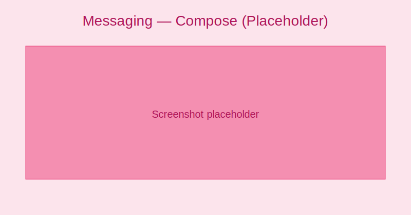
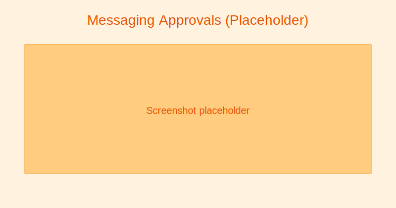

# Messaging & Announcements

Channels:
- In-app messages and announcements
- Email and push notifications
- SMS (if configured)

Composing a message:
- Choose audience: All users, roles, classes, sections, custom group
- Draft message with title and body
- Attach files or links
- Schedule or send immediately

:::tip Screenshot
Compose message screen

_Draft and schedule messages to the right audience._
:::

Visibility rules:
- Admins can message all audiences
- Teachers can message their classes/groups
- Parents/Students can message allowed recipients only

Approval workflows (optional):
- Require moderator approval for school-wide messages
- Track status: Draft → Pending → Approved → Sent

:::note Screenshot
Messaging approvals queue

_Review and approve school-wide announcements before sending._
:::
