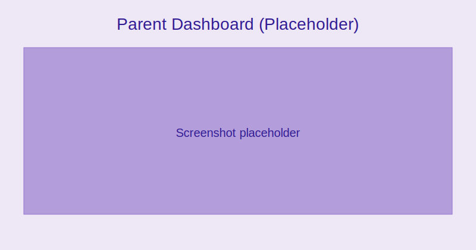
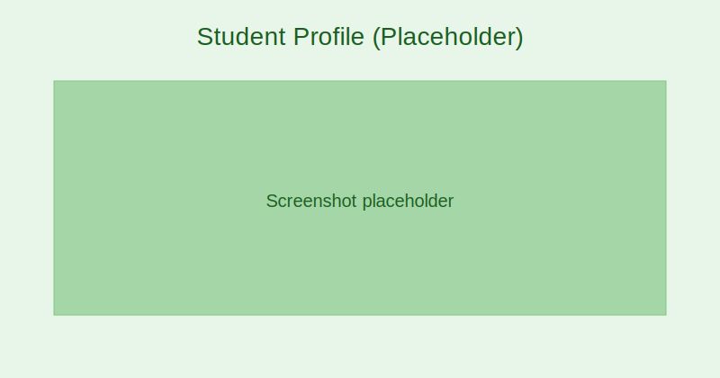
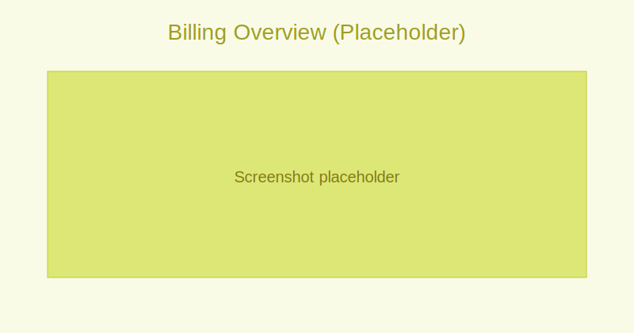

# Parent/Guardian Guide

4SCH dashboard (parent):
- Children overview: Attendance, recent grades, fees
- Alerts: Upcoming events, deadlines, announcements

:::tip Screenshot
Parent Dashboard

_See each child’s latest updates and outstanding actions._
:::

Student Profile:
- Attendance: Daily and subject-wise records
- Grades: Recent results and transcripts
- Timetable: Current schedule and exam calendar
- Documents: School letters, certificates

:::note Screenshot
Student Profile view

_View academic progress, attendance, and documents for your child._
:::

Payments:
- View invoices, due dates, and payment history
- Pay online via connected gateway
- Download receipts for reimbursement

:::note Screenshot
Billing overview

_Pay outstanding invoices and download receipts._
:::

Messaging:
- Contact teachers or school office
- Receive announcements and reminders
- Manage notification preferences

Tips:
- Enable push notifications for time-sensitive updates
- Update contact details under Profile → Account
