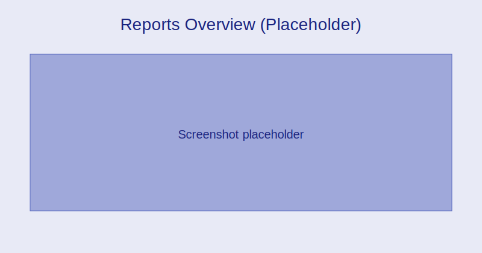

# Reports & Analytics

Dashboards:
- Attendance snapshot, fee collection, and academic performance
- Filters by class, section, term, and date range

:::tip Screenshot
Reports overview dashboard

_Track key indicators across attendance, finance, and academics._
:::

Filters and drilldowns:
- Apply filters to narrow to class/section/date ranges
- Click through to underlying records

:::note Screenshot
Report filters and drilldown

_Use filters to focus and drill into detailed records._
:::

Operational reports:
- Daily attendance summary
- Student roster by class/section
- Fee collection and outstanding balances

Academic reports:
- Grade distribution by subject and class
- Student progress over time
- Exam results and transcripts

Exports:
- CSV, PDF, and print-ready formats
- Schedule recurring exports to email/SFTP
