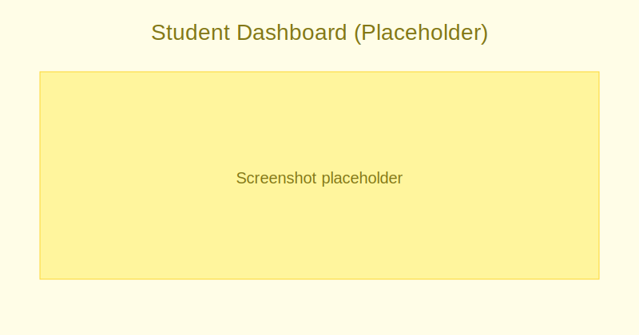
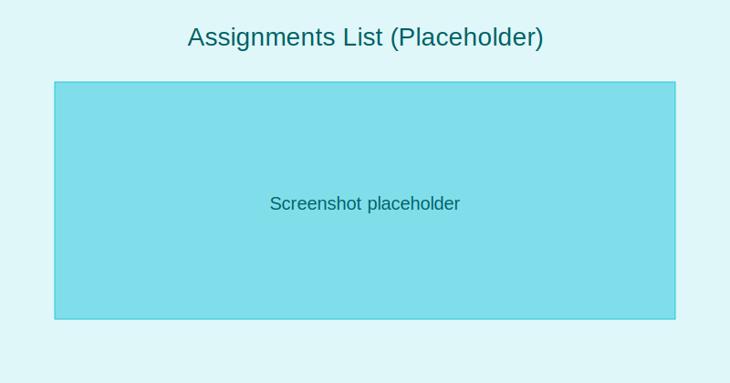

# Student Guide

4SCH dashboard (student):
- Today view: Timetable, assignments due, announcements
- Quick links: Grades, attendance, messages

:::tip Screenshot
Student Dashboard

_Start your day with a quick overview of classes and tasks._
:::

Assignments:
- View assigned work and instructions
- Submit before deadline (file upload or editor)
- Track feedback and scores

:::note Screenshot
Assignments list

_Check what’s due and track submissions and feedback._
:::

Attendance:
- View daily and subject attendance
- Request absence explanation if allowed

Grades:
- Check results per subject and term
- View cumulative progress charts

:::note Screenshot
Student Profile (grades and attendance)

_Review grades by term and attendance trends._
:::

Messaging:
- Receive class announcements
- Ask clarifying questions to teachers when permitted
