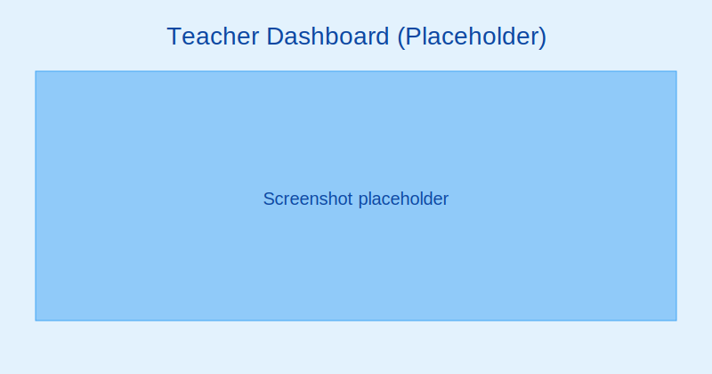
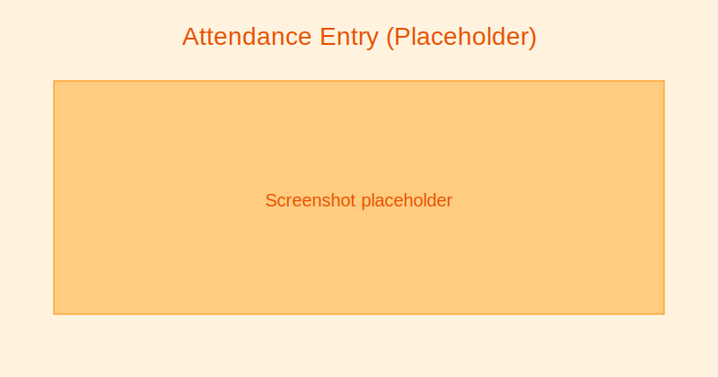
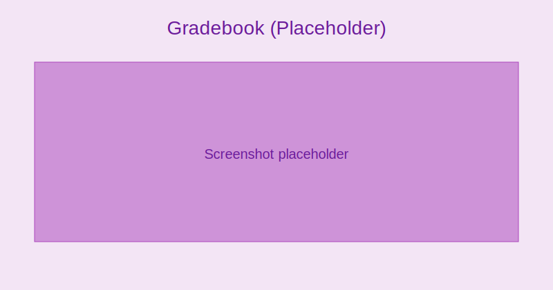

# Teacher Guide

4SCH dashboard (teacher):
- Today’s classes and timetable
- Quick attendance and grade entry
- Recent messages and tasks

:::tip Screenshot
Teacher Dashboard

_Get an at-a-glance view of your schedule and pending tasks._
:::

Daily workflows:
- Take attendance:
  - Open Classes → Select class/period
  - Mark present/absent/late; add notes
  - Submit to notify parents (if enabled)

:::note Screenshot
Attendance entry screen

_Mark daily or period-based attendance and add notes._
:::

- Manage assignments:
  - Create assignment with due date and rubric
  - Collect submissions (file or text)
  - Grade and provide feedback

- Enter grades:
  - Open Gradebook → Select subject and assessment
  - Bulk enter marks, add comments
  - Save draft, then publish to students/parents

:::tip Screenshot
Gradebook entry view

_Enter scores in bulk, add comments, and publish when ready._
:::

- Communicate:
  - Messaging → New message
  - Choose audience (class, group, individuals)
  - Attach files and schedule if needed

Exams and assessments:
- Create assessments tied to exam types
- Customize weightages for class if allowed
- Record scores and moderate results
- Lock gradebook once reviewed

Reports:
- Class performance by assessment
- Attendance trends and follow-ups
- Export grade sheets for meetings
