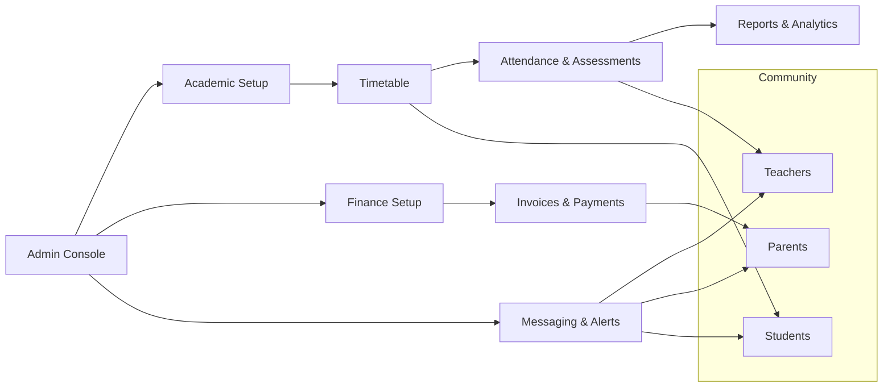

# 4SCH School Management System

import Link from '@docusaurus/Link';
import DataIcon from '@site/src/components/icons/Data';

- Quick links:
  - <Link to="/guides/admin#admin-console-overview">Admin — Dashboard</Link>
  - <Link to="/guides/teachers#teacher-dashboard">Teacher — Dashboard</Link>
  - <Link to="/guides/students#student-dashboard">Student — Dashboard</Link>
  - <Link to="/guides/parents#parent-dashboard">Parent — Dashboard</Link>
  - <Link to="/guides/billing-finance#finance-setup">Finance — Setup</Link>
  - <Link to="/guides/reports-analytics#dashboards">Reports — Dashboards</Link>

4SCH is an all-in-one platform for schools to manage daily operations and engagement across the entire community—administrators, teachers, parents, and students. It centralizes academic records, attendance, grading, timetables, messaging, billing, and reporting in one secure, cloud-hosted system.

Key benefits:
- Unified records: Student, staff, class, and fee data in one place
- Time-saving automation: Timetable publishing, attendance flows, grade calculations, and notifications
- Clear communication: Role-aware messaging, announcements, and alerts
- Actionable insights: Real-time dashboards and comprehensive reports
- Multi-school support: Manage multiple schools or branches with consistent controls

## <DataIcon size={18} /> Unified records

Manage students, staff, classes, and fees in one system of record. Eliminate double entry, reduce errors, and unlock accurate reporting across the school.

- Single source of truth across modules
- Fewer manual updates and fewer errors
- Faster reporting and simpler audits
- Consistent permissions and access control
- Easier integrations (finance, messaging, SIS/LMS)

Primary user roles:
- School Admin: Configure the institution, academic structure, fees, permissions, and compliance
- Teacher: Manage classes, attendance, assignments, grades, and communication
- Parent/Guardian: View student progress, attendance, invoices, and communicate with school
- Student: Access timetable, assignments, grades, attendance notes, and announcements

Core modules:
- Academic Structure: Sessions, terms, classes, sections, subjects
- Attendance: Daily and period-based attendance
- Timetable & Scheduling: Classes, exams, substitutions, room allocations
- Assessments & Grades: Gradebooks, weightages, rubrics, transcripts
- Student Information: Profiles, enrollments, guardians, documents
- Finance: Fees, invoices, payments, concessions, ledgers, receipts
- Messaging & Announcements: In-app, email, push notifications
- Reports & Analytics: Operational and academic reports, exports
- Integrations: Payment gateways, email/SMS, SSO, LMS

High-level flow (Mermaid):

