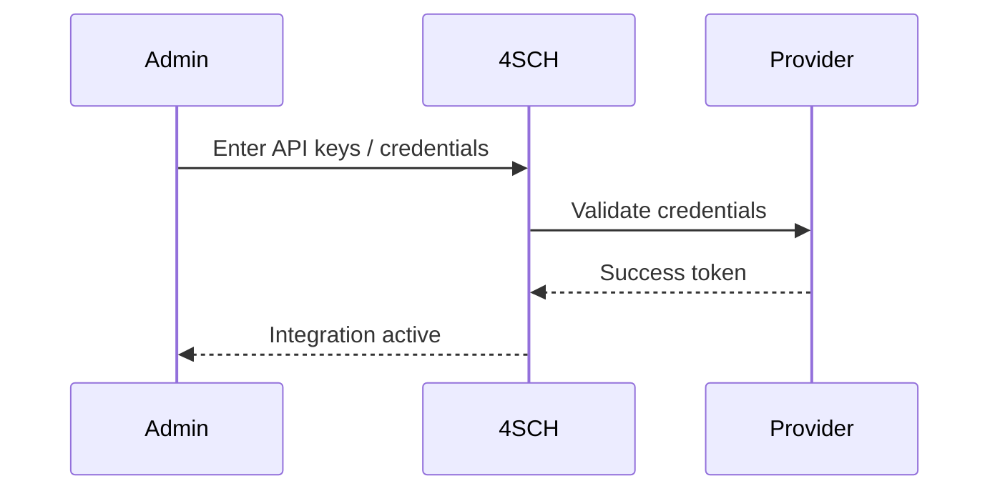

# Integrations

Supported integration types:
- Payment gateways for online fee collection
- Email/SMS providers for notifications
- SSO (e.g., Google, Microsoft) for sign-in
- LMS integrations for assignments and content

Configuration flow:

:::tip Screenshot
Payment gateway configuration

_Add provider keys and verify webhooks to activate online payments._
:::
