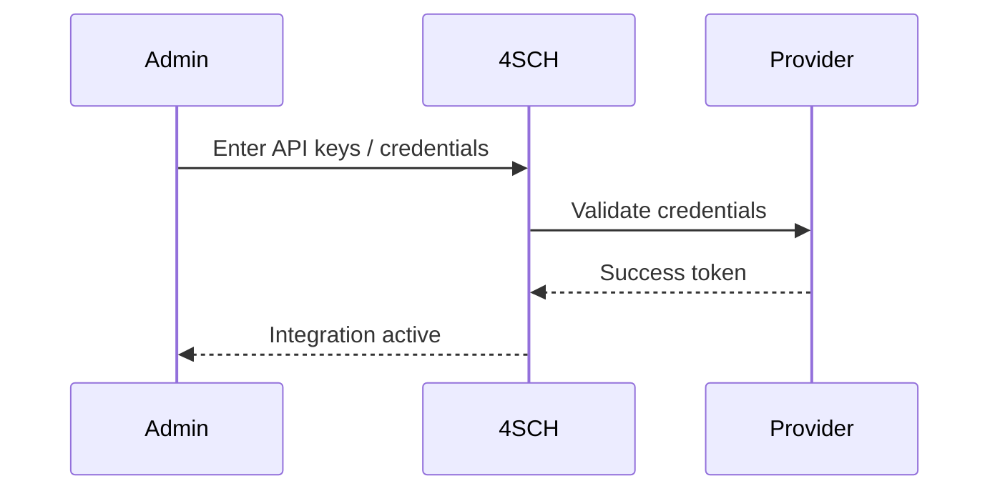

import CardGrid from '@site/src/components/CardGrid';
import FinanceIcon from '@site/src/components/icons/Finance';
import MessagingIcon from '@site/src/components/icons/Messaging';
import UsersIcon from '@site/src/components/icons/Users';

# Integrations

<CardGrid
  cards={[
    { to: '#supported-integration-types', title: 'Types', description: 'Payments, Email/SMS, SSO, LMS', icon: <UsersIcon /> },
    { to: '#configuration-flow', title: 'Flow', description: 'Keys, validation, webhooks', icon: <MessagingIcon /> },
    { to: '#payment-gateway-configuration', title: 'Payments', description: 'Gateways and webhooks', icon: <FinanceIcon /> },
  ]}
/>

## Supported integration types {#supported-integration-types}
- Payment gateways for online fee collection
- Email/SMS providers for notifications
- SSO (e.g., Google, Microsoft) for sign-in
- LMS integrations for assignments and content

## Configuration flow {#configuration-flow}

:::tip Screenshot
### Payment gateway configuration {#payment-gateway-configuration}

_Add provider keys and verify webhooks to activate online payments._
:::
