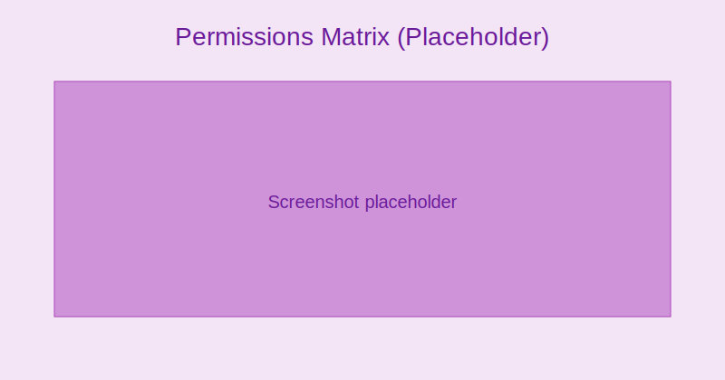

import CardGrid from '@site/src/components/CardGrid';
import UsersIcon from '@site/src/components/icons/Users';
import SecurityIcon from '@site/src/components/icons/Security';

# Roles & Permissions

<CardGrid
  cards={[
    { to: '#default-roles', title: 'Default roles', description: 'Admin, Teacher, Parent, Student, Finance, Registrar', icon: <UsersIcon /> },
    { to: '#custom-roles', title: 'Custom roles', description: 'Granular module/action permissions', icon: <SecurityIcon /> },
    { to: '#security-tips', title: 'Security tips', description: 'Least privilege, MFA, rotation', icon: <SecurityIcon /> },
  ]}
/>

## Default Roles {#default-roles}
- Admin: Full configuration and reporting
- Teacher: Classes, attendance, assessments, messaging
- Parent/Guardian: Child progress, messages, payments
- Student: Timetable, assignments, grades, messages
- Finance: Billing, payments, reports
- Registrar: Admissions, enrollment, transfers

## Custom Roles {#custom-roles}
- Create roles with specific permissions
- Grant access by module and action (view, create, edit, approve)
- Assign roles per user; combine for broader access

:::tip Screenshot
Permissions matrix

_Configure exact capabilities for each role across modules._
:::

## Security Tips {#security-tips}
- Use least privilege
- Require MFA for Admin and Finance roles
- Rotate access for temporary staff
